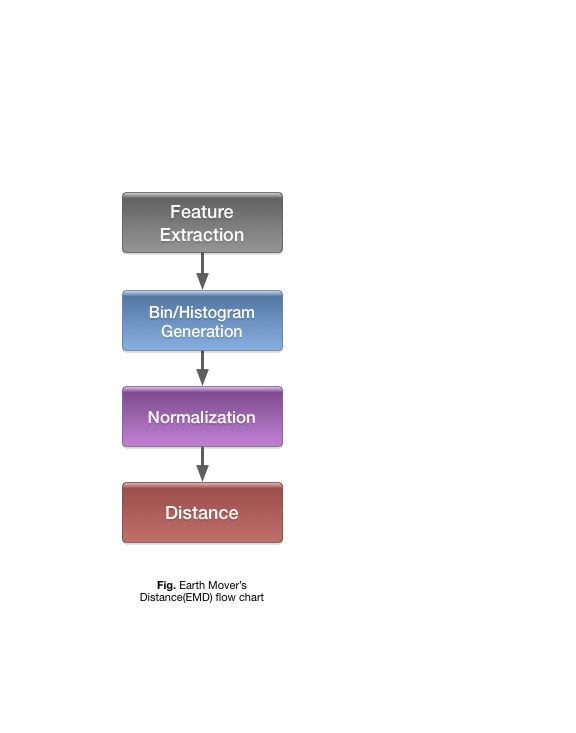
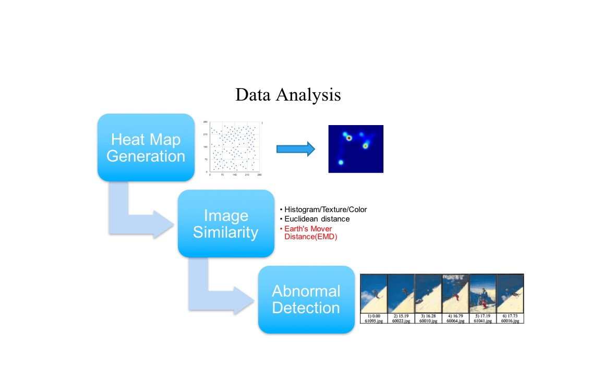

# Final report for Routine Detection
We use GPS data to build a heat map and analyze the map based on an algorithm.
And use the daily map to build a pattern for a person and set a initial EMD value for him/her. If the map shows that there is a big difference in EMD value we could infer that the person's routine is abnormal.

# Project goal
Nowadays people are easily getting depression so an app to detect if a person is in his/her normal routine or not is needed for us.
If a person has some abnormal behaviors at some day, we could use this app to detect where would he go and infer that what will he do.

# Contributors
* [@Duo Liu](https://github.com/DuoL)
* [@Chang Liu](https://github.com/deercoder)
* [@Lijian Wan](https://github.com/LijianWan)

# Advisor
* [@Guanling Chen](https://github.com/gchenhub)

# Background
We are living in a big data area where sensors are everywhere, i.e. Fitbit to record every day activity, Light sensor to control the light; even smart phones have a lot of sensor in it. How can we make use of these sensors? We came up with an idea which is that since we use our phone every day, why don’t we make use of the GPS sensor in it to record our daily location. If one day we feel tired, I can look back into the data and find out the reason of it. Maybe we stay in GYM for a long time or maybe I walked a long distance. Therefore we use Google map API to record our daily location data, and use these data to generate a heatmap, then use the heatmap to find out the anomaly.

# Project features
* run in the background
* run every 10 seconds
* cost 3% of battery for every 20mins

# Project design

* Approach

* Basic flow

* EMD Algorithm

* Data Analysis Flow

* 1.Develop a Geolocation collector by using: 
	* Framework:Ionic
	* API:Google Map API
	* Database:localStorage
	* Plugins:ngCordova
	* Page:HTML
	* Script:JavaScript
	 
* 2.Build a heat map each day using collected data
	* Using google map API
	* Heatmaps
	* 

* 3.Design an algorithm to deal with the heat maps 
	* EMD
	* 

# File structure
* App file
	* hooks
		* This collected how many plugins I've used in this app
	* platforms
		* The simulator of both ios and android are here
	* resources
		* Both the ios and android drivers are here
	* scss
		* Ionic framework's structure like css for html
	* www
		* index.html:The front page of the app where you can see how many scrpits are there in the background
		* css
			* format every html page
		* lib
			* save for angularJS
		* js	
			* app.js: deploy the controller in every page
			* controllers.js:create some functions like getCurrentGeolocation about the front page
			* directives.js: if using angular model then we can add it here 
			* ng-cordova.min.js: the resource file of ngCordova
			* route.js:link the controller to every page in the template
			* service.js:same as controller but in this app it could be empty
	* Data_Analysis file
		* EMD file: EMD is our selected algorithm to compare images and compute distance between two images.
			* MATLAB: MATALB implementation of EMD distance for faster convergence(as pyEMD is too time-consuming when building the histgram, and comparing too many images)
			* PYTHON: We use open source pyEMD to calculate the distance between two images, and this emd.py demo shows how it works for two natural images, we can further extend it to heatmap images as well.
	* Heatmaps
		* The heatmaps we built in the last 2 weeks
		* Heatmaps link(https://github.com/uml-ubicomp-2016-spring/ubicomp16-GPSCollector/tree/master/Data_Analysis/Heatmaps)

# Project evaluation
* Paper reference
	* We use this trajectories as a reference for detecting a person's daily routine.
	
	* trajectories Paper link(http://www.ucl.ac.uk/~ucfamus/papers/ubicomp15_trajectories.pdf)

* Comparison
	* I think the paper's data set is better than us because they got 14 people's geolocation data and give them a PHQ to verify if the result is right or not. What we used is just a dataset from only one person so it cannot cover some special case.
	
	* Using PHQ Score may cost a lot of time and sometimes it might be hard to have volunteers.So we did better than the novel is that we use heat map to analyze the data set which is visually much convenient than the novel we used EMD to show the difference between a normal image and an abnormal image it is absolutely easy for most people to recgonize this pattern. 
	
* Learned things

	* We've learned that GPS is an amazing data that we can use it not only to get our destination but also can help us infer if a person is in his normal routine or not. What's more, we hope that we could infer a person's GPA based on the GPS data set.
	
	* We currently have no ways to verify the correctness of our result but using PHQ might be a good try
	
# References
>[1]Ionic http://ionicframework.com/

>[2]ngCordova getGeolocation http://ngcordova.com/docs/plugins/geolocation/

>[3]Trajectories http://www.ucl.ac.uk/~ucfamus/papers/ubicomp15_trajectories.pdf

>[4]localStorage https://developer.mozilla.org/en-US/docs/Web/API/Window/localStorage
